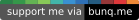

# Ricardo's Personal Website

[](https://www.codacy.com/manual/ricardobalk/www?utm_source=github.com&amp;utm_medium=referral&amp;utm_content=ricardobalk/www&amp;utm_campaign=Badge_Grade) [](https://github.styleci.io/repos/200295886) [](https://app.fossa.com/projects/git%2Bgithub.com%2Fricardobalk%2Fwww?ref=badge_shield)

[](https://github.com/sponsors/ricardobalk) [](https://bunq.me/ricardodev/2.50/Support%20for%20your%20work%20on%20GitHub) [](https://ko-fi.com/H2H71EMIK)


This repository contains my personal website. It's made with VuePress, ZURB Foundation and Docker.

- VuePress provides a way to run a blog with Markdown files.
- Foundation is used for its 12 column grid layout, but I'm [getting rid of that soon (#63)](https://github.com/ricardobalk/www/issues/63).
- Docker packs up everything and ensures that everything works as expected, on any computer.


**Driven by JAMstack, and proud of it!**

My website is basically a JAMstack website. JAMstack (JavaScript, APIs and Markup) is not something you would install, but an approach for having a simpler developer experience, higher performance, lower cost and greater scalability.


# Building / Developing

To build or develop my website, I recommend using Docker, as this prevents you from installing and configuring many things. I just like to get shit done in a fast and effective way. Don't blame me for that. :man_shrugging:

## 1) Pull or build the Docker image

The first step is to pull my website's Docker image from Docker Hub, or build it locally with to the _Dockerfile_ recipe found in the root directory of this repository.

**Pull from Docker Hub (recommended)**

```sh
docker pull ricardobalk/website
```

**Build it yourself**

Assuming you've cloned this repository and are currently in the directory where the Dockerfile resides...

```sh
docker build -t ricardobalk/website .
```

## 2) Run Docker image in a container.

The second step is to run the freshly created _image_ in a _container_. You could choose to run a dev server for development purposes, or to build my website.

**DEV SERVER**


```sh
docker run --rm \
  --mount type=bind,source="$(pwd)"/src/,target=/home/node/app/src/,readonly \
  -p 8080:8080 \
  ricardobalk/website "dev"
```

This will launch a dev server which you could use to tinker and try things. After a while, visit http://localhost:8080/. You're good to go.

P.S. You could also omit the bind mounts to just see the site as it was published to Docker Hub.

**BUILD**

```sh
mkdir -p ./dist/
```

```sh
docker run --rm \
  --mount type=bind,source="$(pwd)"/src/,target=/home/node/app/src/,readonly \
  --mount type=bind,source="$(pwd)"/dist/,target=/home/node/app/dist/ \
  ricardobalk/website "build"
```

This will build the website and place the result in `dist/`. You can use your own server to serve this directory.

## 3) Deploy

Although I don't expect **you** to deploy **my** website, here are the instructions given as a reference.

**DEPLOY**

Build the website using the instructions above. After that, use `rsync` to push the contents of `dist/` to your server.

```sh
rsync -ru dist/. ricardobalk.nl:/var/www/ricardobalk.nl --delete
```

That was easy! Build and upload. No need for heavy back-ends and complex databases. This is possible because we're working with a JAMstack website. :tada:

P.S. If you're not using Linux, macOS or WSL, you could also upload the contents of `dist/` via (S)FTP. I'll just stick with the `rsync` approach, because I like to get shit done and save time. :+1:

**REMOVAL**

```sh
docker image rm ricardobalk/website
```

This will remove the image. Removal of the containers is not necessary because the `--rm` flag was used. However, if there still are containers that depend on the image, Docker will notify you :wink:

## Doing the same without Docker...

Don't want to use Docker and prefer to use a local installation? Read the [Slowstart Guide](./SLOWSTART.md). But be careful, zombies might come after you.

---

# License

This website including all blog articles are licenced under the GPL 3.0+ license.

Please note that this product includes software and libraries from 3rd parties which could have a different license. See the below image for more information.

[](https://app.fossa.com/projects/git%2Bgithub.com%2Fricardobalk%2Fwww?ref=badge_large)
